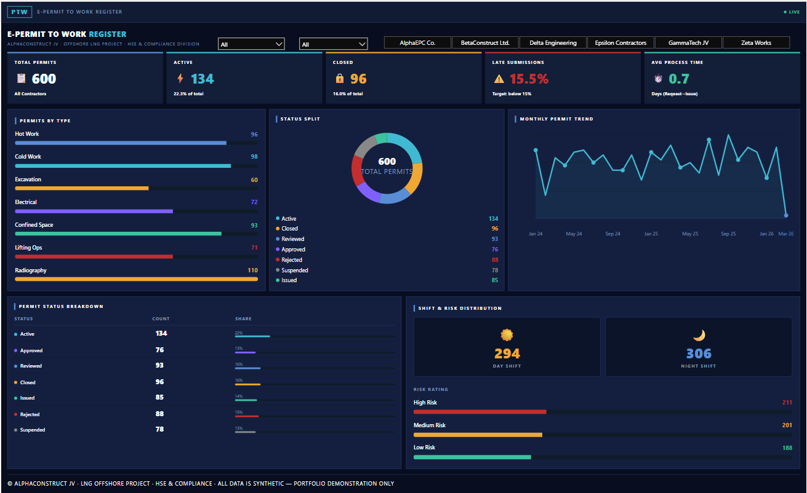

# PTW-dashboard-portfolio
Power BI PTW Analytics Dashboard — HTML KPI cards, SVG charts in DAX, star schema data model. Built for industrial LNG construction environment. Synthetic data only.
# PTW Analytics Dashboard — Power BI Portfolio Project

> End-to-end Permit to Work reporting system built for a 
> large-scale industrial LNG construction project.

## 🔍 Business Problem
A major EPC joint venture needed a centralised system to track 
PTW compliance, monitor permit statuses, and generate 
management-ready reports — replacing a manual Excel process.

## 💡 What Was Built
- Dynamic HTML KPI cards rendered via DAX (Nova Silva HTML Viewer)
- SVG donut chart built entirely in DAX — no JavaScript needed
- SVG line chart for monthly permit trends — built in DAX
- CSS progress bar charts for permit type and status breakdown
- Conditional formatting — Late Submission turns red above 15%
- Star schema data model (1 fact + 4 dimension tables)

## 🛠️ Tools & Stack
Power BI Desktop | DAX | Power Query | HTML/CSS/SVG in DAX  
Nova Silva Shielded HTML Viewer

## 📐 Data Model
Star schema:
- **Fact:** E-PTW ACTIVE
- **Dimensions:** Dim_Date | Dim_PermitType | Dim_Company | Dim_Area

## 🔗 Live Demo
👉 [View Live Dashboard](https://f4fuaad.github.io/PTW-dashboard-portfolio)

## 📁 Files
| File | Description |
|---|---|
| `Portfolio_Dashboard.pbix` | Power BI file with all DAX measures |
| `fake_ptw_data.xlsx` | Synthetic dataset (600 rows, 74 columns) |
| `generate_fake_ptw_data.py` | Python script used to generate fake data |
| `index.html` | Standalone HTML demo (GitHub Pages) |
| `dashboard_preview.png` | Dashboard screenshot |

## ⚠️ Data Note
All data is fully synthetic and does not represent any real 
company, project, or individuals. Generated using Python's 
Faker library purely for portfolio demonstration.

## 👤 Author
**Syed Mohammed Fuaad**  
Power BI & Automation Analyst | Qatar  
[GitHub](https://github.com/f4fuaad) | [LinkedIn](https://www.linkedin.com/in/f4fuaad)
